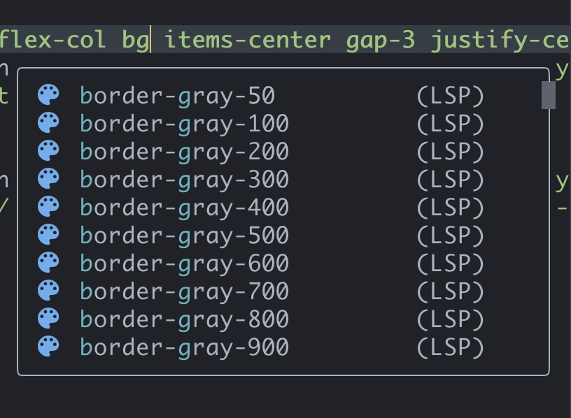
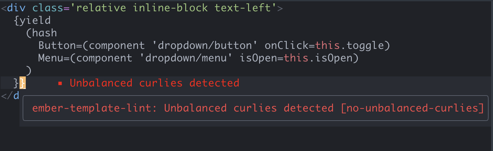
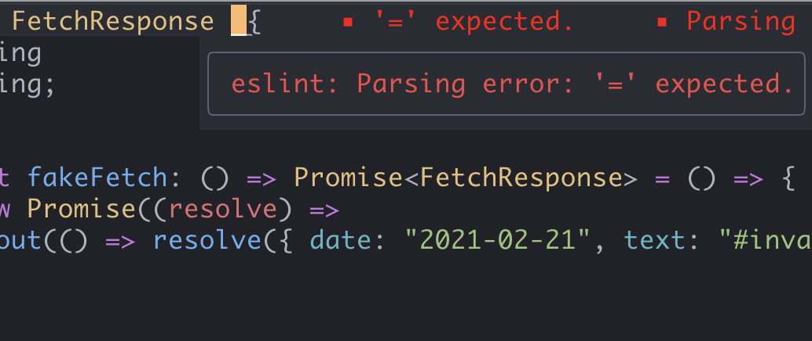
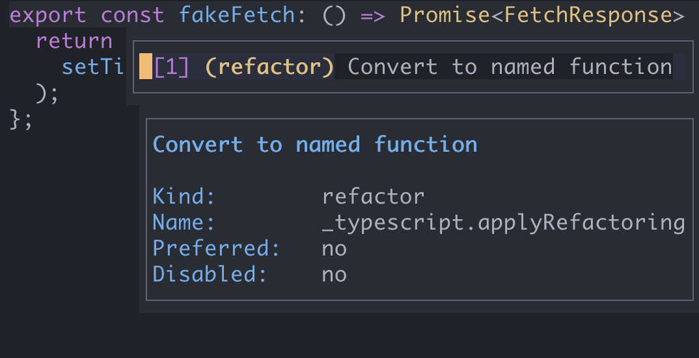

# lvim

My lunarvim configuration. This is mainly the default Lunarvim configuration, but with support for things I use often:

- typescript
- javascript
- tailwindcss
- ember
- react

## Language Support

### tailwind completion


`Ctrl+j` and `Ctrl+k` to move up and down between suggested auto-completions.

### ember template lint


### eslint
Errors are displayed in a hover box (this is easier to read than the default inline error messages):


### prettier
Pressing `ctrl+s` will save the file and run prettier. This only works if you have a proper prettier config in your root directory.

If you have an error in your prettier config (like a typo) this will silently fail.

### Code Actions Menu


Pressing `Space + `` (backtick) will bring up a code actions menu.


## Trying it out

```bash
# save a backup of your current config
mv ~/.config/lvim ~/.config/lvim_backup
# clone this code into your lunarvim config directory
git clone hhttps://github.com/nicolechung/lvim.git ~/.config/lvim
# update lunarvim and reset the cache
lvim +LvimUpdate +LvimCacheReset +q
# install the plugins in this configuration
lvim # run :PackerSync
```

## Things you might need to install

```bash
# for: nvim-telescope/telescope-live-grep-args.nvim
brew install ripgrep

# for prettier
npm/yarn install -g prettier

# for eslint
npm/yarn install -g eslint
```

## Notes about requiring files

Files in `lua/user` can be required with just using `user`:

```lua
-- Example
require("user.keybindings").setup()
```

When opened with <leader> (spacebar) Lc (Lunar -> config), the import will work correctly.
