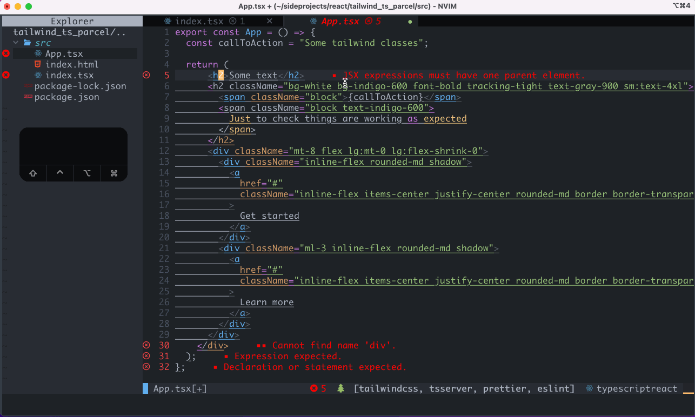

# lvim

My lunarvim configuration. This is mainly the default Lunarvim configuration, but with support for things I use often:

- typescript
- javascript
- tailwindcss
- ember
- react

Made with help from JimSchofield / nvim.

## Language Support

## tailwind, typescript


Press `control + j` and `control + k` to cycle through tailwind classes and typescript autocompletion.

## react



Press `<space> + \`` to activate the Code Actions Menu. Press a number to select the code fix.

Press `control + s` to save and auto format.

## Trying it out

```bash
# save a backup of your current config
mv ~/.config/lvim ~/.config/lvim_backup
# clone this code into your lunarvim config directory
git clone hhttps://github.com/nicolechung/lvim.git ~/.config/lvim
# update lunarvim and reset the cache
lvim +LvimUpdate +LvimCacheReset +q
# install the plugins in this configuration
lvim # run :PackerSync
```

## Things you might need to install

```bash
# for: nvim-telescope/telescope-live-grep-args.nvim
brew install ripgrep

# for prettier
npm/yarn install -g prettier

# for eslint
npm/yarn install -g eslint
```

## Notes about requiring files

Files in `lua/user` can be required with just using `user`:

```lua
-- Example
require("user.keybindings").setup()
```

When opened with <leader> (spacebar) Lc (Lunar -> config), the import will work correctly.
